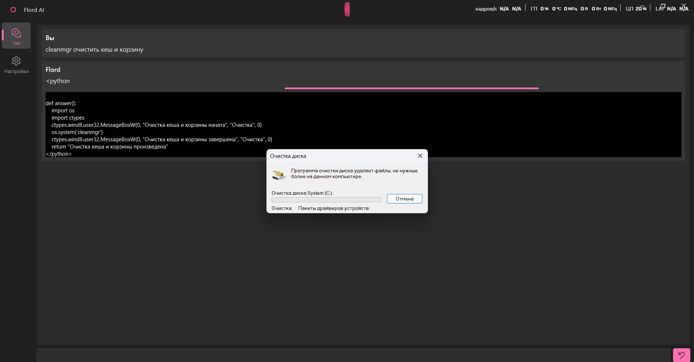
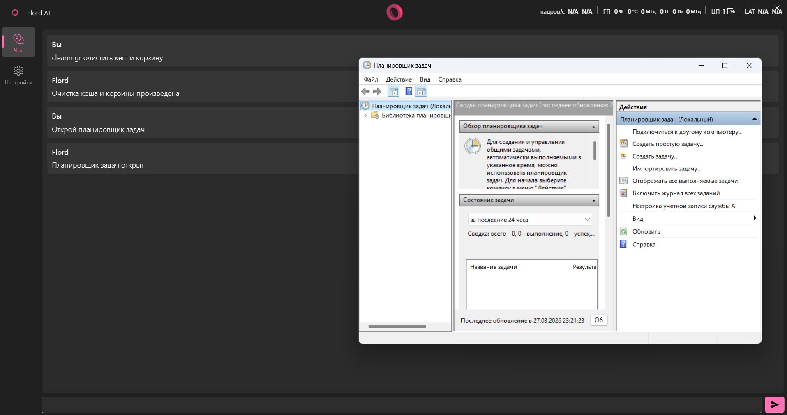

# Flord AI
#### Умный ИИ-ассистент для Windows 10/11 с управлением через Telegram

## 🚀 Скачать

👉 **Последняя версия:** v0.0.2

📦 **Скачать приложение:**
https://github.com/Jurom4ik/FlordAI/releases/tag/v0.0.2

или сразу `.exe`:
https://github.com/Jurom4ik/FlordAI/releases/download/v0.0.2/FlordAI.exe

---

⚠️ Если Windows ругается на файл — нажмите "Подробнее" → "Всё равно запустить"


> ### Важно
> Этот проект является экспериментом. 
> Всё, что вы делаете - вы делаете на свой страх и риск.
> Если вдруг действия программы приведут к потери данных и/или повреждению устройства - автор проекта не несёт никакой ответственности.
> (Я вас предупредил)

## Скриншоты

### Очистка кэша и корзины


### Открытие планировщика задач


## Возможности

- **Голосовое управление компьютером** - Flord может выполнять действия на вашем ПК через Python-код
- **Четыре режима работы ИИ:**
  - **OpenRouter API** - доступ к Claude, GPT-4, Llama и другим мощным моделям (бесплатные модели с `:free`)
  - **Google Gemini** - бесплатный API от Google AI Studio
  - **Groq** - сверхбыстрый бесплатный API с Llama 3.1 и другими моделями
  - **Ollama (локальные модели)** - полностью локальная работа с LLM, приватность данных
- **Управление через Telegram** - общайтесь с ассистентом из любой точки мира
- **Автоматическая установка Ollama** - простая настройка локальных моделей
- **Самоисправляющийся агент** - исправляет ошибки в коде в реальном времени
- **Голосовой ассистент** - голосовое управление через микрофон
- **Мониторинг системы** - отслеживание системных ресурсов в реальном времени

## 🆕 v0.0.2 - Self-Healing Technology

### 📁 Новые компоненты:

**🤖 `flord/self_healing_agent.py`**
- Умный агент для самокоррекции ошибок ИИ
- Автоматическое исправление кода в реальном времени
- Статистика и история исправлений
- Интеграция с Mind классом

**🗣️ `flord/voice_assistant.py`**
- Голосовое управление через микрофон
- Распознавание речи (Google Speech API)
- Синтез речи с поддержкой русского языка
- Настройка голоса и скорости речи

**📊 `flord/system_monitor.py`**
- Мониторинг системы в реальном времени
- Отслеживание CPU, памяти, диска, сети
- Проверка здоровья системы с рекомендациями
- Топ процессов по использованию ресурсов

**🔧 `flord/code_fixer_agent.py`**
- Автоматическое исправление синтаксических ошибок
- Проверка и исправление импортов
- Переименование устаревших названий
- Сканирование Python файлов в проекте

### ✨ Улучшения интерфейса:
- **🗑️ Удаление сообщений** - кнопка удаления у каждого сообщения
- **🧹 Очистка чата** - полная очистка одним кликом
- **🔑 Управление токенами** - кнопки удаления API ключей
- **⚡ Улучшенная обработка ошибок** - умные retry и самокоррекция

## Примеры использования

Программа не содержит готовых сценариев - всё генерируется ИИ в реальном времени:

- "Что у меня на рабочем столе?"
- "Открой диспетчер задач / настройки / программу"
- "Какой заряд батареи?"
- "Создай документ Word с текстом..."
- "Громкость на 50%"
- "Сверни все окна"

## Установка и запуск

```bash
git clone https://github.com/Jurom4ik/Flord.git
cd Flord
python -m venv venv
venv\Scripts\activate
pip install -r requirements.txt
python flord\main.py
```

## Настройка

### OpenRouter (облачные модели)
1. Получите API ключ на [openrouter.ai](https://openrouter.ai)
2. Введите ключ в настройках приложения
3. Выберите модель с суффиксом `:free` для бесплатного использования

### Google Gemini (бесплатный API)
1. Получите API ключ на [makersuite.google.com](https://makersuite.google.com/app/apikey)
2. Введите ключ в настройках приложения
3. Выберите модель (рекомендуется: `gemini-1.5-flash`)

### Groq (быстрый бесплатный API)
1. Получите API ключ на [console.groq.com](https://console.groq.com/keys)
2. Введите ключ в настройках приложения  
3. Выберите модель (рекомендуется: `llama-3.1-8b-instant`)

### Ollama (локальные модели)
1. Включите "Автоматическая установка" в настройках
2. Или установите вручную с [ollama.com](https://ollama.com)
3. Выберите модель (рекомендуется: llama3.2, qwen2.5, phi4)

### Telegram Бот
1. Напишите [@BotFather](https://t.me/botfather) в Telegram
2. Создайте нового бота и получите токен
3. Введите токен в настройках Flord
4. Бот запустится автоматически

## Доступные локальные модели

- `llama3.2:latest` - быстрая, хорошая для повседневных задач
- `phi4:latest` - от Microsoft, компактная и эффективная  
- `qwen2.5:latest` - отличное качество на разных языках
- `mistral:latest` - мощная европейская модель
- `deepseek-coder:latest` - специализированная для кода

## Требования

- Windows 10/11
- Python 3.10+
- Для Ollama: 8GB+ RAM (рекомендуется 16GB)
- Для OpenRouter: интернет-соединение

## Благодарности

- [OpenRouter](https://openrouter.ai) - Unified API для LLM
- [Google Gemini](https://makersuite.google.com) - Бесплатный API от Google
- [Groq](https://groq.com) - Сверхбыстрый API для LLM
- [Ollama](https://ollama.com) - Локальные модели
- [aiogram](https://docs.aiogram.dev) - Telegram Bot API
- [PyQt6](https://www.riverbankcomputing.com/software/pyqt/)
- [QFluentWidgets](https://qfluentwidgets.com/)

---

**Разработчик:** Jurom4ik  
**Версия:** 0.0.2  
**🚀 Self-Healing Technology**
